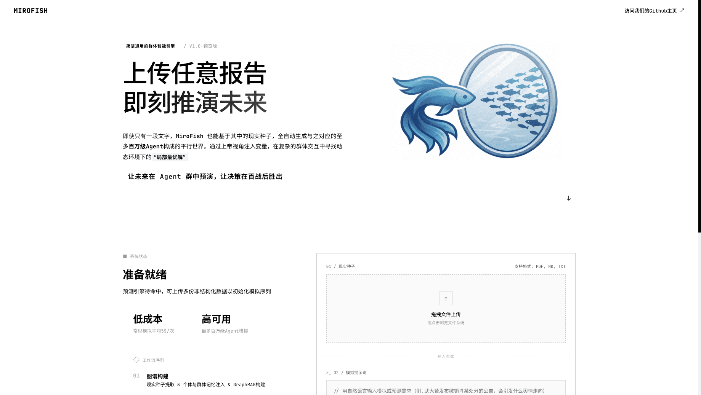

<div align="center">


# MiroFish No-Zep

A lightweight refactor of the original MiroFish project, adjusted for philosophy-oriented social simulation.

[中文](./README.md) | [English](./README-EN.md)

</div>

## What This Repository Is

This repository is not meant to replace the original MiroFish project.  
It is a narrower, simpler branch built around a specific use case.

The starting point was practical:

- kunkun, a philosophy student, wanted to use MiroFish to simulate the social world described in Plato's *Republic*.
- The original workflow depended on Zep Cloud in places, which added setup cost for instructors who are not especially interested in managing extra APIs and cloud memory services.
- So this refactor removes that dependency from the main local workflow and tries to keep the project usable with only an LLM API key.

The product refactor and requirement cleanup were led from a product perspective, with the goal of making the system easier to use in teaching and small experiments.

In short:

> this is a no-Zep, lighter MiroFish branch for local philosophy simulation.

## What Changed

Compared with the upstream project, this branch mainly does the following:

- removes hard dependency on Zep Cloud
- uses local file graphs when `USE_ZEP=false`
- provides local fallback paths for report retrieval
- keeps the multi-agent simulation workflow, but simplifies the setup
- allows direct editing of agent `sentiment_bias` in Step 2

This version is better suited for:

- classroom demos
- small-scale thought experiments
- philosophy text based simulations
- local deployment without extra cloud services

If you want the full upstream vision and ecosystem, you should still refer to the original MiroFish repository.

## Workflow

1. Upload source material
2. Generate ontology and project text
3. Build a local graph
4. Generate personas and simulation config
5. Run the simulation
6. Generate a report
7. Continue interacting with agents and report tools

## Quick Start

### Requirements

| Tool | Version |
|------|---------|
| Node.js | 18+ |
| Python | 3.11 - 3.12 |
| uv | Latest |

> Python 3.13 is not recommended because some dependencies may fail during installation.

### 1. Configure `.env`

Create a root `.env` file like this:

```env
LLM_API_KEY=your_api_key
LLM_BASE_URL=https://api.openai.com/v1
LLM_MODEL_NAME=gpt-4o-mini

USE_ZEP=false
PORT=5001
```

Notes:

- `USE_ZEP=false` is the intended mode of this fork
- any OpenAI-compatible LLM endpoint should work
- `ZEP_API_KEY` is no longer required for the main local workflow

### 2. Install Dependencies

```bash
npm run setup:all
```

Or step by step:

```bash
npm run setup
npm run setup:backend
```

### 3. Start

```bash
npm run dev
```

Services:

- Frontend: `http://localhost:3000`
- Backend: `http://localhost:5001`

## Main Features Kept in This Fork

### Local Graph

When `USE_ZEP=false`, the project uses local graph JSON files for:

- graph inspection
- report search
- quick search
- panorama search
- report-side local fallback logic

### Scene Hot Configuration

Step 2 supports editable scene configuration:

- scene name
- scene description
- triggering event
- actor list
- initial posts

This makes the project usable for custom philosophy scenarios, not only one fixed demo setup.

### Editable Agent Sentiment Bias

In Step 2, you can now directly edit and save:

- `sentiment_bias`

This is useful for simple comparison experiments on how emotional baselines change the simulation.

## Screenshots

<div align="center">
<table>
<tr>
<td></td>
<td></td>
</tr>
<tr>
<td></td>
<td></td>
</tr>
<tr>
<td></td>
<td></td>
</tr>
</table>
</div>

## Relation to the Original Project

- Original project: `666ghj/MiroFish`
- This repository: a lighter no-Zep fork for philosophy simulation

## Credits

- Original open-source project: **MiroFish**
- Multi-agent simulation engine: **[OASIS](https://github.com/camel-ai/oasis)**
- Use-case initiator: kunkun

## License

This repository follows the original project license. See [LICENSE](./LICENSE).
